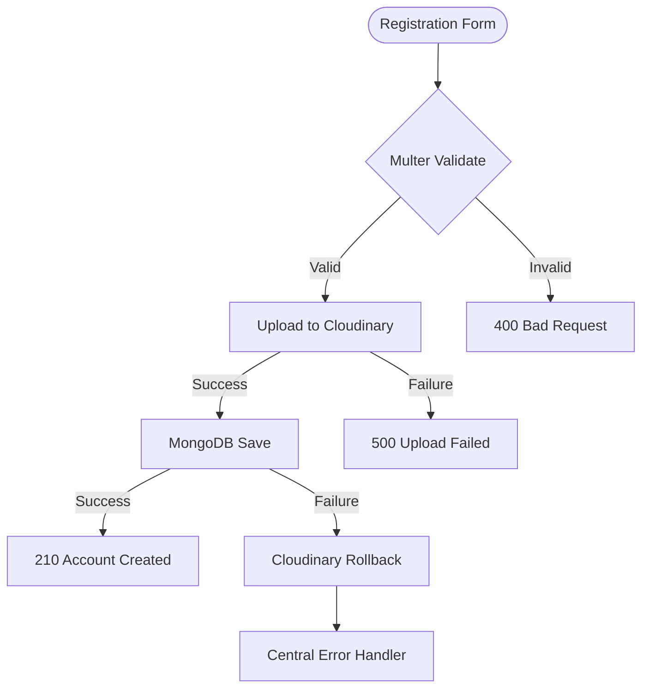

# 🚀 BlogApp Backend — Developer Portal & Documentation Hub

Welcome to the **BlogApp Backend** codebase. This is a secure, high-performance, and scalable REST API built using **Node.js**, **Express v5**, **MongoDB (Mongoose)**, and **Cloudinary** for image hosting.

The server implements dynamic CORS controls, secure HttpOnly cookie session management, and robust, role-based route protection filters.

---

## 🌐 Live Deployed Environments

*   **⚡ Live Web Platform (Frontend)**: [blog-app-frontend-one-lake.vercel.app](https://blog-app-frontend-one-lake.vercel.app/)
*   **🔌 Live API Server (Backend)**: [blogapp-backend-5dvn.onrender.com](https://blogapp-backend-5dvn.onrender.com/)

---

## 🛠️ Technology Stack

The backend uses a modern, light Node.js framework designed for reliability:

*   **Runtime & Server Framework**: [Node.js](https://nodejs.org) & [Express v5](https://expressjs.com) (Dynamic body routing, improved error wrappers)
*   **Database & ODM**: [MongoDB](https://www.mongodb.com) & [Mongoose v9](https://mongoosejs.com) (Strict schemas, populated relationships, embedded document models)
*   **Authentication & Security**: [JSON Web Tokens (JWT)](https://jwt.io) & [BcryptJS](https://github.com/dcodeIO/bcrypt.js) (Encrypted passwords, secured tokens)
*   **Media Storage Integration**: [Cloudinary](https://cloudinary.com) & [Multer](https://github.com/expressjs/multer) (In-memory buffer streaming, automatic fail-safe rollbacks)
*   **Session Handler**: [Cookie Parser](https://github.com/expressjs/cookie-parser) (Encrypted cookie transmission via HttpOnly transport)
*   **Development Utility**: [Nodemon](https://nodemon.io) (Auto-reloading dev environment)

---

## 📂 Documentation Quick Links

We have organized the developer documentation into five specialized technical guides:

```text
BlogApp_backend/docs/
├── 🏗️ architecture.md      -> Express pipelines, Mongoose models, and global error middleware
├── 🔒 authentication.md    -> Password hashing (Bcrypt), JWT generation, and HttpOnly cookies
├── 🔌 api-routes.md        -> REST API endpoints, allowed role filters, and payload variables
├── 🖼️ media-uploads.md      -> Multer configs, Cloudinary uploads, and DB rollback strategies
└── 🛠️ deployment-setup.md   -> Environment parameters, Nodemon dev servers, and Render deployment
```

### 🧭 Explore by Technical Topic

| Document Guide | Focus Topics | Target Audience |
| :--- | :--- | :--- |
| [🏗️ Database & Pipelines](file:///d:/BlogApp/Blog%20App/BlogApp_backend/docs/architecture.md) | Schema design schemas, validation handling, central error middleware | Database Engineers |
| [🔒 Auth & Cookies](file:///d:/BlogApp/Blog%20App/BlogApp_backend/docs/authentication.md) | Bcrypt salting, HttpOnly cookie security flags, verified authorization tokens | Security Architects |
| [🔌 REST APIs Directory](file:///d:/BlogApp/Blog%20App/BlogApp_backend/docs/api-routes.md) | Endpoint scopes (`/common-api`, `/user-api`, `/author-api`, `/admin-api`) | API Consumers |
| [🖼️ Media Uploads Wrapper](file:///d:/BlogApp/Blog%20App/BlogApp_backend/docs/media-uploads.md) | Multer storage limits, Cloudinary streams, fail-safe file rollbacks | Storage Engineers |
| [🛠️ Local Setup & Deployments](file:///d:/BlogApp/Blog%20App/BlogApp_backend/docs/deployment-setup.md) | Environment configurations (`.env`), nodemon development, Render web services | DevOps, Systems |

---

## 🔄 Media Upload & Database Rollback Flow

One of the robust features of the backend is the in-memory media upload pipeline with automatic database rollbacks. This ensures Cloudinary storage stays clean and free of orphaned images if database updates fail:



---

## 🚀 Quick Start (Local Setup)

Spin up the local API server in seconds:

### 1. Install Dependencies
```bash
npm install
```

### 2. Configure Environment Variables
Create a `.env` file in the root directory:
```env
PORT=4000
DB_URL=mongodb://localhost:27017/blogDB1
FRONTEND_URL=http://localhost:5173
JWT_SECRET=your_secret_key
CLOUD_NAME=your_cloudinary_name
API_KEY=your_cloudinary_key
API_SECRET=your_cloudinary_secret
```

### 3. Start Development Server
```bash
npm run dev
```
The server will boot up and listen on port **4000**. Verify its status by visiting [http://localhost:4000/](http://localhost:4000/).

---

## 📄 License

This software is distributed under the terms of the MIT License. See [LICENSE](LICENSE) for details.