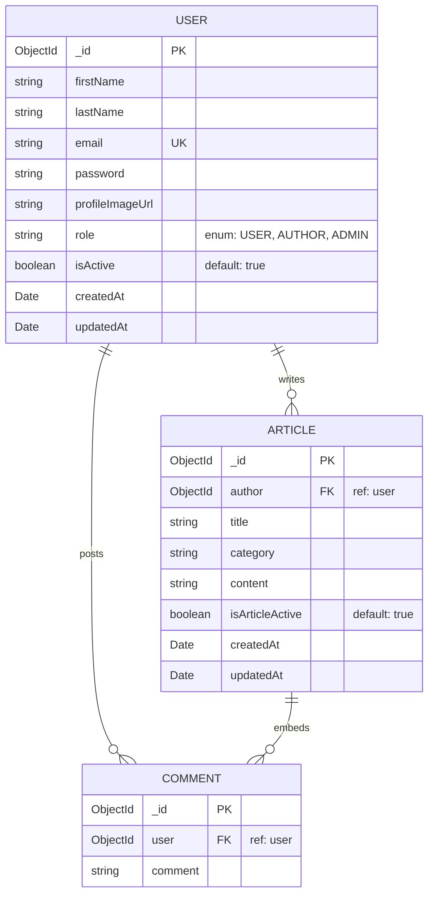
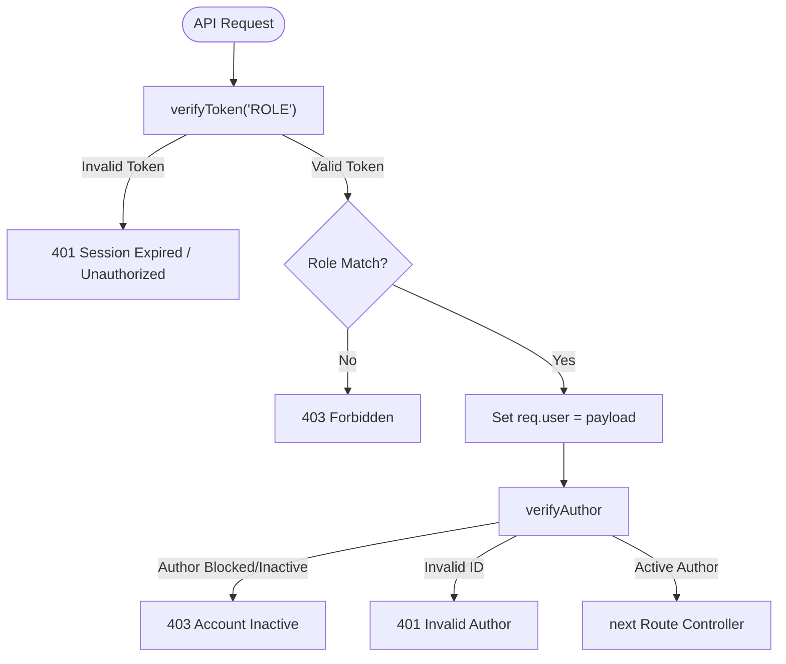
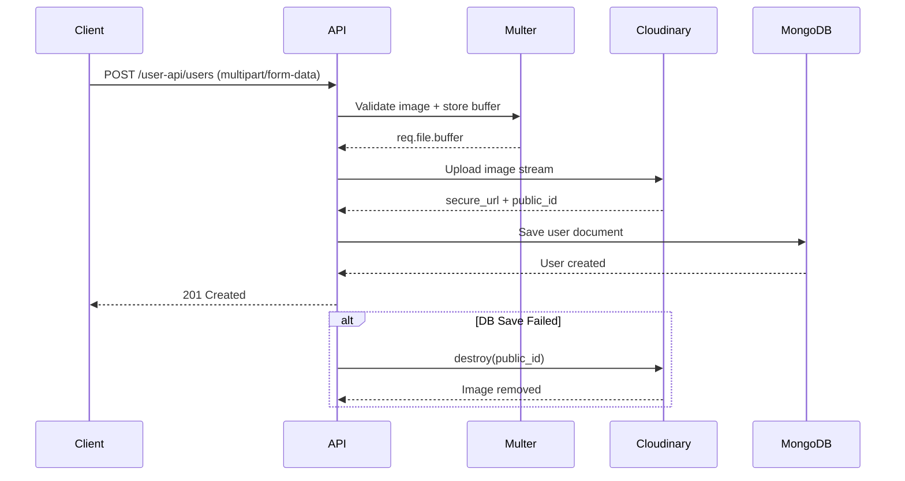
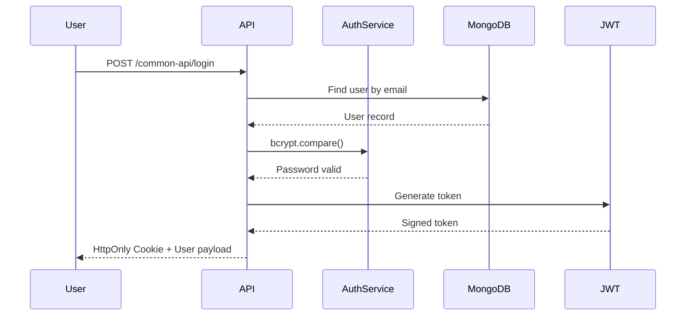
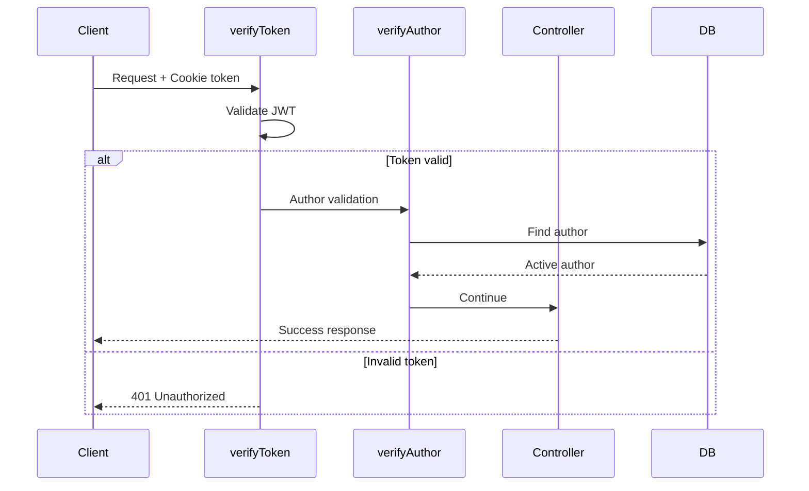
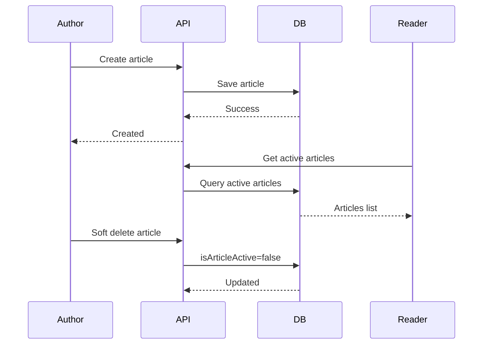

# BlogApp Backend Documentation

# Combined BlogApp Backend Documentation


---

# Source: architecture.md

# 🏗️ Backend System Architecture & Data Schema

This document details the Express application pipeline, Mongoose database design, data relationships, and central error management of the **BlogApp Backend**.

---

## 📂 Backend Directory Structure

The server follows a structured model-view-controller (MVC) architecture styled for scale and rapid REST endpoint routing:

```text
BlogApp_backend/
├── APIs/                     # 🛣️ REST Route Endpoints (common, user, author, admin)
│   ├── adminAPI.js
│   ├── authorAPI.js
│   ├── commonAPI.js
│   └── userAPI.js
├── config/                   # 🔌 Cloudinary & Multer disk storage controllers
│   ├── cloudinary.js
│   ├── cloudinaryUpload.js
│   └── multer.js
├── middleware/               # 🛡️ Route interceptors, guards, and credentials checking
│   ├── verifyAuthor.js
│   └── verifyToken.js
├── models/                   # 💾 MongoDB Mongoose Data Schemas
│   ├── articleModel.js
│   └── userModel.js
├── services/                 # 🧠 Authentication pipelines and business logic
│   └── authService.js
├── server.js                 # 🚀 App entry, DB init, & error middlewares
├── .env                      # 📡 Server configurations & API keys
└── req.http                  # ⚡ HTTP client test suite
```

---

## 💾 Mongoose Data Schemas & Relationships

The database is built on **MongoDB** using Mongoose schemas with strict validations, strict schema validation errors, auto-timestamp generators, and relational references:



### 1. User Model (`UserTypeModel`)
*   **Collection Name**: `users`
*   **Mongoose Schema Options**:
    *   `timestamps: true`: Automatically creates and updates `createdAt` and `updatedAt` datetime properties.
    *   `strict: 'throw'`: Throws a validation error if any extra or undefined parameters are sent in request payloads, protecting database integrity.
    *   `versionKey: false`: Removes the default `__v` internal Mongoose document version property from Mongo documents.

#### Detailed Schema Properties

| Field Name | Data Type | Database Constraints & Rules | Custom Validation Message | Purpose |
| :--- | :--- | :--- | :--- | :--- |
| `firstName` | `String` | Required | `"First name is required"` | User's first name for personalization. |
| `lastName` | `String` | Optional | *None* | Optional family name. |
| `email` | `String` | Required, Unique | `"Email is required"`, `"Email already exist"` | Session identifier and communication handle. |
| `password` | `String` | Required | `"Password is required"` | Securely salted and hashed password digest. |
| `profileImageUrl` | `String` | Optional | *None* | Secure Cloudinary CDN link to the profile photo. |
| `role` | `String` | Required, Enum: `["AUTHOR", "USER", "ADMIN"]` | `"{Value} is an invalid role"` | Platform routing permission controls. |
| `isActive` | `Boolean` | Optional, Default: `true` | *None* | Flag used by administrators to suspend/block access. |

---

### 2. Article Model (`ArticleModel`)
*   **Collection Name**: `articles`
*   **Mongoose Schema Options**: Enforces `{ timestamps: true, strict: "throw", versionKey: false }` mirroring the User model rules.

#### Detailed Schema Properties

| Field Name | Data Type | Database Constraints & Rules | Custom Validation Message | Purpose |
| :--- | :--- | :--- | :--- | :--- |
| `author` | `ObjectId` | Required, Relational Ref: `'user'` | `"Author ID required"` | Links the article directly to the creating Author. |
| `title` | `String` | Required | `"Title is required"` | Title of the story. |
| `category` | `String` | Required | `"Category is required"` | Tag to group articles (e.g. Tech, General). |
| `content` | `String` | Required | `"Content is required"` | Full body markdown content of the story. |
| `isArticleActive`| `Boolean` | Optional, Default: `true` | *None* | Used for soft-delete controls by Authors/Admins. |
| `comments` | `Array` | List of embedded `userCommentSchema` | *None* | List of reader reviews posted on the article. |

#### Sub-Document: User Comment Schema (`userCommentSchema`)
The comments list is modeled as an embedded sub-document array nested directly inside each article document. This eliminates the need for expensive Mongoose aggregate pipelines:

| Sub-Field Name | Data Type | Database Constraints & Rules | Purpose |
| :--- | :--- | :--- | :--- |
| `user` | `ObjectId` | Relational Ref: `'user'` | References the Reader who posted the review. |
| `comment` | `String` | Optional | Raw text content of the review. |


---

## 🔀 Central Express Middleware Pipeline

All incoming HTTP requests follow a modular middleware pipeline:

```text
[HTTP Request]
      │
      ├──► [CORS Policy Validator] -> Checks process.env.FRONTEND_URL list
      ├──► [Express JSON Body Parser] -> Resolves json payloads
      ├──► [Cookie Parser Parser] -> Extracts httpOnly Session Token
      │
      ├──► [REST Route Routers] (Matches: /common-api, /user-api, etc.)
      │         │
      │         ├──► [verifyToken Guard] -> Confirms validity, decoding payload
      │         ├──► [verifyAuthor Check] -> Confirms Author state & DB status
      │         └──► [Controller Logic]
      │
      └──► [Centralized Error Handling Middleware]
```

---

## 🛡️ Centralized Error Handling Handler (`server.js`)

The application implements a robust error handling middleware at the end of the chain in `server.js`. This captures all database exceptions and custom API errors, converting them into uniform JSON responses:

### Standardized Error Responses
*   **Mongoose `ValidationError` (status: 400)**: Catches Schema field requirements failures and formats error strings.
*   **Mongoose `CastError` (status: 400)**: Triggered when invalid Mongo IDs (e.g., malformed Hex strings) are passed into params.
*   **Duplicate Key Exception (status: 409)**: Catches MongoDB native Error Code `11000` (e.g. duplicate email registrations) and returns an clean response (e.g., `email "user@domain.com" already exists`).
*   **Custom Server Errors**: Reads custom `err.status` parameters created during service workflows and formats clean client responses.
*   **Fallback 500 Handler**: Returns a safe, non-leaking message (`"Server side error"`) for unexpected runtime exceptions.


---

# Source: authentication.md

# 🔒 Security, Authentication & Session Strategy

This document details the authentication models, encryption layers, token generations, cookie architectures, and custom security check middleware used by the **BlogApp Backend**.

---

## 🔑 Password Hashing (BcryptJS)

The application prioritizes user credential security by completely decoupling plain-text passwords before storing them in MongoDB:

*   **Algorithm**: **Blowfish block cipher encryption (Bcrypt)**
*   **Complexity**: Enforces **12 rounds of salt generation** (`bcrypt.hash(password, 12)`).
*   **Logic Pipeline**:
    1.  During user creation (`services/authService.js`), a validation check (`await userDoc.validate()`) is run to check parameters.
    2.  The password is encrypted, completely replacing the plain-text property.
    3.  The encrypted document is saved to MongoDB.
    4.  The output document is parsed (`userDoc.toObject()`) and the password field is deleted before returning the payload to the frontend.

---

## 🎟️ JSON Web Tokens (JWT) & Generation

Authentications issue a secure, signed **JSON Web Token** storing essential session properties:

### Token Payload Structure
```json
{
  "userId": "6a0b50e4b3d9d9bd2e2ec661",
  "_id": "6a0b50e4b3d9d9bd2e2ec661",
  "role": "AUTHOR",
  "email": "writer@blogapp.com",
  "firstName": "John",
  "lastName": "Doe",
  "profileImageUrl": "https://res.cloudinary.com/..."
}
```

*   **Signature Key**: The token is signed using `process.env.JWT_SECRET`.
*   **Expiry**: Tokens are bound to a **1-hour expiration timeframe** (`{ expiresIn: "1h" }`) to minimize session hijack windows.

---

## 🍪 HttpOnly Cookie Transport Strategy

To protect tokens from cross-site scripting (XSS) extraction attacks, the backend transfers JWTs exclusively inside **HttpOnly Cookies**:

```javascript
res.cookie("token", token, {
    httpOnly: true,       // Prevents client-side scripts (document.cookie) from reading the token
    sameSite: "none",     // Allows cross-site cookie transfers (frontend hosted on different servers)
    secure: true,         // Enforces transfer ONLY over HTTPS connections
    maxAge: 24 * 60 * 60 * 1000, // Cookie remains valid for 1 day
    partitioned: true     // Enables CHIPS (Cookies Having Independent Partitioned State) for modern browsers
})
```

> [!TIP]
> The addition of `partitioned: true` ensures the session cookie is stored cleanly inside third-party iframe partitions, which prevents modern browser layout engines (like Chrome's Sandbox) from blocking authorization headers in embedded viewports.

---

## 🛡️ Security Middlewares Breakdown

The backend uses two security middleware layers inside the route chains:



### 1. Unified Token Verification Guard (`verifyToken.js`)
*   **Core Logic**: Extracts `req.cookies.token`, parses it via `jwt.verify()`, and attaches the parsed payload directly to `req.user`.
*   **Dynamic Role Check**: Evaluates if the authenticated role exists inside the route parameters:
    ```javascript
    export const verifyToken = (...allowedRoles) => {
        // Enforces role-based route guards
    }
    ```
*   **Exception Catching**: Distinguishes normal validation errors from `TokenExpiredError` (returning a clear session expired message).

### 2. Author DB Status Validator (`verifyAuthor.js`)
*   **Core Logic**: Authors can write, edit, and soft-delete stories. To ensure blocked or deleted accounts are immediately barred from posting, this middleware queries the database directly on each write request:
    1.  Extracts the `authorId` from path parameters or body requests.
    2.  Performs a MongoDB find (`UserTypeModel.findById()`).
    3.  Validates that the account role matches `"AUTHOR"` and that `isActive` equals `true`.


---

# Source: api-routes.md

# 🔌 REST API Routes & Endpoints Directory

This document lists all REST API endpoints available in the **BlogApp Backend**, classified by role scope.

---

## 🌐 Public / Guest Scopes (`/common-api`)

Unified public actions, visitor queries, and general session validation pathways.

### 1. Read All Active Articles
*   **Path**: `GET /common-api/articles`
*   **Access**: Public (Unauthenticated)
*   **Returns**: Active articles in reverse chronological order (`createdAt: -1`), populated with author metadata.
*   **Response Shape**:
    ```json
    {
      "message": "public articles",
      "payload": [
        {
          "_id": "6a0b50e4b3d9d9bd2e2ec661",
          "title": "Introduction to Tailwind v4",
          "category": "Tech",
          "content": "Tailwind CSS v4 is a major release...",
          "comments": [],
          "author": {
            "_id": "6a0b50e4b3d9d9bd2e2ec662",
            "firstName": "Jane",
            "lastName": "Doe",
            "profileImageUrl": "https://..."
          },
          "isArticleActive": true,
          "createdAt": "2026-05-19T04:00:00Z"
        }
      ]
    }
    ```

### 2. Login User
*   **Path**: `POST /common-api/login`
*   **Access**: Public (Unauthenticated)
*   **Body**:
    ```json
    {
      "email": "user@blogapp.com",
      "password": "Password123"
    }
    ```
*   **Response**: Sets secure cookie `token` and returns a success payload:
    ```json
    {
      "message": "login success",
      "payload": {
        "_id": "6a0b50e4b3d9d9bd2e2ec661",
        "firstName": "John",
        "lastName": "Doe",
        "email": "user@blogapp.com",
        "role": "USER",
        "profileImageUrl": "https://...",
        "isActive": true
      }
    }
    ```

### 3. Logout User
*   **Path**: `GET /common-api/logout`
*   **Access**: Public (Clears Cookie)
*   **Response**: Resets cookie variables and outputs a success payload.

### 4. Check Auth Session
*   **Path**: `GET /common-api/check-auth`
*   **Access**: Public (Lenient validation)
*   **Returns**: Evaluates active cookies.
    *   If valid: `{ "message": "authenticated", "payload": decodedToken, "isAuthenticated": true }`
    *   If invalid/missing: `{ "message": "not authenticated", "payload": null, "isAuthenticated": false }` (No 401 response issued to prevent browser errors).

---

## 📖 Reader / User Scopes (`/user-api`)

Actions restricted to readers (`USER`).

### 1. Register User Profile
*   **Path**: `POST /user-api/users`
*   **Access**: Public
*   **Payload Format**: `multipart/form-data`
*   **Form Fields**: `firstName`, `lastName`, `email`, `password`, and optional image file `profileImageUrl`.
*   **Response (201)**:
    ```json
    {
      "message": "user created",
      "payload": {
        "_id": "6a0b50e4b3d9d9bd2e2ec663",
        "firstName": "Jane",
        "lastName": "Doe",
        "email": "reader@blogapp.com",
        "role": "USER",
        "profileImageUrl": "https://...",
        "isActive": true
      }
    }
    ```

### 2. Read Dashboard Feed
*   **Path**: `GET /user-api/articles`
*   **Access**: Guarded (`verifyToken("USER")`)
*   **Returns**: All active articles.

### 3. Comment on an Article
*   **Path**: `PUT /user-api/articles`
*   **Access**: Guarded (`verifyToken("USER")`)
*   **Body**:
    ```json
    {
      "articleId": "6a0b50e4b3d9d9bd2e2ec661",
      "user": "6a0b50e4b3d9d9bd2e2ec663",
      "comment": "Outstanding write-up! Really helpful."
    }
    ```
*   **Response**: Returns the updated article containing the populated comment.

---

## ✍️ Writer / Author Scopes (`/author-api`)

Actions restricted to creators (`AUTHOR`).

### 1. Register Author Profile
*   **Path**: `POST /author-api/users`
*   **Payload**: `multipart/form-data` (Similar to user registration, automatically setting role to `AUTHOR`).

### 2. Create Article
*   **Path**: `POST /author-api/articles`
*   **Access**: Guarded (`verifyToken("AUTHOR")`)
*   **Body**:
    ```json
    {
      "author": "6a0b50e4b3d9d9bd2e2ec662",
      "title": "Deploying React 19",
      "category": "Tech",
      "content": "Deploying React 19 applications requires..."
    }
    ```
*   **Response (210)**: Success payload.

### 3. Edit Article
*   **Path**: `PUT /author-api/articles`
*   **Access**: Guarded (`verifyToken("AUTHOR")`)
*   **Body**: Includes `articleId`, `title`, `content`, `category`, and `author`.

### 4. Delete Article (Soft Delete)
*   **Path**: `DELETE /author-api/articles/authorId/:authorId/articleId/:articleId`
*   **Access**: Guarded (`verifyToken("AUTHOR")` + owner verification)
*   **Action**: Sets `isArticleActive: false`. The article is hidden from readers but remains visible in the author's dashboard.

### 5. Restore Article
*   **Path**: `PATCH /author-api/articles/authorId/:authorId/articleId/:articleId`
*   **Action**: Sets `isArticleActive: true`.

---

## ⚙️ Administration Scopes (`/admin-api`)

Platform moderation and metrics actions, restricted to administrators (`ADMIN`).

### 1. Get All Articles
*   **Path**: `GET /admin-api/articles`
*   **Access**: Guarded (`verifyToken("ADMIN")`)
*   **Returns**: All articles in the database (including soft-deleted ones) with author metadata.

### 2. Get Users / Authors lists
*   **Paths**: `GET /admin-api/users`, `GET /admin-api/authors`
*   **Returns**: Complete registries matching target roles (excluding passwords).

### 3. Toggle User Active Status (Block/Unblock)
*   **Path**: `PUT /admin-api/toggle-user-status/:userId`
*   **Access**: Guarded (`verifyToken("ADMIN")`)
*   **Body**: `{ "isActive": false }` (or `true` to unblock)
*   **Action**: Updates account status. If set to `false`, the user is immediately logged out and barred from access.

### 4. Toggle Article Active Status
*   **Path**: `PUT /admin-api/toggle-article-status/:articleId`
*   **Body**: `{ "isArticleActive": false }`
*   **Action**: Toggles article visibility globally.


---

# Source: media-uploads.md

# 🖼️ Media Uploads, Multer & Cloudinary Integration

This document details the configuration and pipelines for handling image uploads, validating file formats, streaming assets to **Cloudinary**, and managing database rollbacks on failure.

---

## 🏗️ Visual Media Upload Pipeline

The application processes user profile uploads dynamically in memory, ensuring no temporary files leak onto local disk drives:

```text
[Frontend Registration Form]
     │ (multipart/form-data with profileImageUrl image)
     ▼
[Multer Memory Middleware] -> Validates file size (<2MB) & MIME type (JPG/PNG)
     │
     ├──► [MIME/Size Invalid] ──► Return 400 Bad Request
     ▼
[Buffer Object (req.file.buffer)]
     │
     ▼
[Cloudinary Upload Helper] -> Streams buffer to Cloudinary over HTTPS
     │
     ├──► [Upload Success] ─────► Extract secure_url & public_id
     │                                 │
     │                                 ▼
     │                      [MongoDB userDoc.save()]
     │                                 │
     │            ┌────────────────────┴────────────────────┐
     │            ▼ [Database Save Success]                 ▼ [Database Save Failure]
     │     [Return 201 Created]                     [FAIL-SAFE ROLLBACK]
     │                                                      │
     │                                                      ▼
     │                                           [Cloudinary destroy()]
     │                                           (Deletes uploaded image immediately)
     │                                                      │
     │                                                      ▼
     │                                            [Return 400/409 Error]
```

---

## 📁 Multer Memory Configuration (`config/multer.js`)

Multer intercepts registration requests, checking file metadata before passing it to memory storage:

```javascript
export const upload = multer({
  storage: multer.memoryStorage(), // Keeps file as a buffer in RAM to prevent disk space leaks
  limits: {
      fileSize: 2 * 1024 * 1024,   // Rejects files larger than 2MB
  },
  fileFilter: (req, file, cb) => {
      // Security check: strictly validate MIME types
      if (file.mimetype === "image/jpeg" || file.mimetype === "image/png") {
          cb(null, true);
      } else {
          const err = new Error("Only JPG and PNG allowed");
          err.status = 400;
          cb(err, false);
      }
  }
});
```

---

## ☁️ Cloudinary SDK Integration (`config/cloudinary.js`)

Cloudinary credentials are loaded securely from the environment configuration:

```javascript
cloudinary.config({
  cloud_name: process.env.CLOUD_NAME,
  api_key: process.env.API_KEY,
  api_secret: process.env.API_SECRET,
});
```

### ⚡ Upload Stream Wrapper (`config/cloudinaryUpload.js`)
Since the files are stored in memory, we stream them directly to Cloudinary:

```javascript
export const uploadToCloudinary = (buffer) => {
  return new Promise((resolve, reject) => {
      const stream = cloudinary.uploader.upload_stream(
          { folder: "blog_users" }, // Saved inside the blog_users folder
          (err, result) => {
              if (err) return reject(err);
              resolve(result);
          }
      );
      stream.end(buffer); // Ends stream and flushes buffer to Cloudinary
  });
};
```

---

## 🛡️ Fail-Safe Database Rollback Routine

If an image upload succeeds but the user registration subsequently fails database validation (e.g. duplicate email conflicts), the orphaned image is deleted from Cloudinary immediately:

```javascript
let cloudinaryResult;

try {
    let userObj = req.body;
    
    // Step 1: Upload image to Cloudinary from memory buffer
    if (req.file) {
        cloudinaryResult = await uploadToCloudinary(req.file.buffer);
    }
    
    // Step 2: Register user in MongoDB
    const newUserObj = await register({
        ...userObj,
        role: "USER", // Or AUTHOR
        profileImageUrl: cloudinaryResult?.secure_url,
    });
    
    res.status(201).json({ message: "user created", payload: newUserObj });

} catch (err) {
    // Step 3: ROLLBACK (Delete orphan image if database save failed)
    if (cloudinaryResult?.public_id) {
        await cloudinary.uploader.destroy(cloudinaryResult.public_id);
    }
    
    next(err); // Forward the validation error to central middleware
}
```
This ensures Cloudinary storage remains clean and free of orphaned images.


---

# Source: deployment-setup.md

# 🛠️ Backend Setup, local development & Deployment Guide

This guide provides instructions for setting up, configuring, and deploying the **BlogApp Backend** application.

---

## 💻 Local Development Setup

### Prerequisites
*   **Node.js**: Version `18.x` or higher (recommended: `20.x` LTS)
*   **MongoDB**: An active local instance (`mongodb://localhost:27017/blogDB1`) or a MongoDB Atlas cloud cluster.

### 1. Project Initialization & Package Installation

If you are setting up the project from scratch or installing the modules manually, here are the step-by-step instructions.

#### Step A: Initialize the Node.js Project
Create a `package.json` configurations file:
```bash
# Initialize npm with default settings
npm init -y
```

> [!NOTE]
> Make sure to add `"type": "module"` inside your root `package.json` to enable ES6 dynamic module loading (e.g. using `import` instead of `require`).

#### Step B: Install Production Dependencies
Run the following command to install the required production libraries:
```bash
npm install express@^5.2.1 mongoose@^9.1.5 jsonwebtoken@^9.0.3 bcryptjs@^3.0.3 cookie-parser@^1.4.7 cors@^2.8.6 dotenv@^17.2.3 multer@^2.1.1 cloudinary@^2.9.0
```

Here is a breakdown of what each package is used for:
*   `express`: Express v5 framework for REST API routing and endpoints.
*   `mongoose`: Mongoose v9 Object Data Modeling (ODM) library for MongoDB queries and schemas.
*   `jsonwebtoken`: JSON Web Token generator and validator for secure HttpOnly sessions.
*   `bcryptjs`: Secure cryptographic password-hashing salting library.
*   `cookie-parser`: Middleware to extract and parse HTTP session cookies automatically.
*   `cors`: Cross-Origin Resource Sharing validator allowing authorized frontend connections.
*   `dotenv`: Loads environment parameters (`.env`) into the Express server environment.
*   `multer`: In-memory file storage manager intercepting image upload payloads.
*   `cloudinary`: Cloudinary SDK streaming profile images directly to the media cloud.

#### Step C: Install Development Dependencies
Run the following command to install Nodemon for hot-reloading development support:
```bash
npm install -D nodemon@^3.1.11
```

#### Step D: Install All Packages (Existing Repository)
If you already have `package.json` cloned, simply execute the standard install command:
```bash
npm install
```

---

### 2. Configure Environment Variables
Create a `.env` file in the root of the `BlogApp_backend` directory:
```env
# Server Port Configuration
PORT=4000

# MongoDB Database Connection String
DB_URL=mongodb://localhost:27017/blogDB1

# Authorized CORS Origins (Comma-separated list of allowed URLs)
FRONTEND_URL=http://localhost:5173

# Security Key for JWT Signatures
JWT_SECRET=your_super_long_jwt_signature_secret_key_here

# Cloudinary Integration credentials (for profile images)
CLOUD_NAME=your_cloudinary_cloud_name
API_KEY=your_cloudinary_api_key
API_SECRET=your_cloudinary_api_secret
```

---

## 🚀 Running Commands

These scripts are defined in `package.json` and are available via `npm run <command>`:

### Start Development Server (Nodemon)
Starts the node server with automatic reloading when file changes are detected:
```bash
npm run dev
```

### Start Production Server
Starts the application in production mode:
```bash
npm start
```

---

## 📦 Production Deployment Guide (Render)

Render is recommended for hosting Node.js Express APIs.

### Step 1: Connect Git Repository
1.  Push your codebase to your Git provider (GitHub, GitLab, or Bitbucket).
2.  Log into your [Render Dashboard](https://render.com) and click **New + > Web Service**.
3.  Import the BlogApp repository.

### Step 2: Configure Web Service Parameters
Set the following properties in the Render dashboard:
*   **Name**: `blogapp-backend-service`
*   **Runtime**: `Node`
*   **Root Directory**: `BlogApp_backend`
*   **Build Command**: `npm install`
*   **Start Command**: `node server.js`
*   **Instance Type**: `Free` (or appropriate tier)

### Step 3: Add Environment Variables
Under the **Environment Variables** tab, add all keys defined in your local `.env` file:
*   Set `PORT` to `4000` (Render binds this port automatically).
*   Set `DB_URL` to your production MongoDB Atlas cluster string.
*   Set `FRONTEND_URL` to your live Vercel frontend URL (`https://blog-app-frontend-one-lake.vercel.app`).
*   Set your production `JWT_SECRET`, `CLOUD_NAME`, `API_KEY`, and `API_SECRET`.

Click **Deploy Web Service**! Render will build your dependencies and launch the server.

---

## 🔎 API Health & Test Verification

You can test that the API is running correctly using the root health check endpoint:

*   **Endpoint**: `GET /`
*   **Expected Response (200 OK)**:
    ```json
    {
      "message": "Blog App API is running..."
    }
    ```

> [!TIP]
> The project includes a `req.http` file containing pre-configured HTTP requests. You can run these directly within your IDE (using extensions like REST Client) to test and verify backend routes easily.


# 🔄 System Sequence Diagrams

## User Registration with Profile Upload



## Login Authentication Flow



## Protected Route Access



## Article Lifecycle


