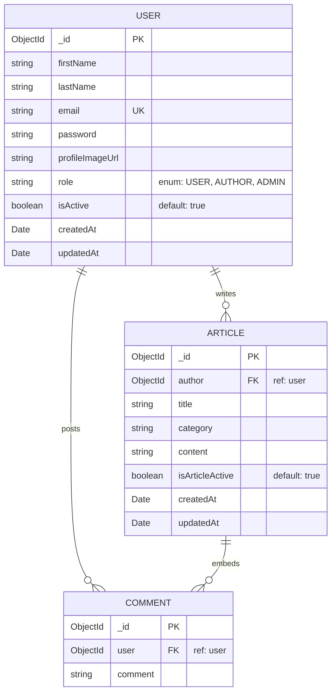

# 🏗️ Backend System Architecture & Data Schema

This document details the Express application pipeline, Mongoose database design, data relationships, and central error management of the **BlogApp Backend**.

---

## 📂 Backend Directory Structure

The server follows a structured model-view-controller (MVC) architecture styled for scale and rapid REST endpoint routing:

```text
BlogApp_backend/
├── docs/                     # 📄 Comprehensive Backend Developer Docs
├── APIs/                     # 🛣️ REST Route Endpoints (common, user, author, admin)
│   ├── adminAPI.js
│   ├── authorAPI.js
│   ├── commonAPI.js
│   └── userAPI.js
├── config/                   # 🔌 Cloudinary & Multer disk storage controllers
│   ├── cloudinary.js
│   ├── cloudinaryUpload.js
│   └── multer.js
├── middleware/               # 🛡️ Route interceptors, guards, and credentials checking
│   ├── verifyAuthor.js
│   └── verifyToken.js
├── models/                   # 💾 MongoDB Mongoose Data Schemas
│   ├── articleModel.js
│   └── userModel.js
├── services/                 # 🧠 Authentication pipelines and business logic
│   └── authService.js
├── server.js                 # 🚀 App entry, DB init, & error middlewares
├── .env                      # 📡 Server configurations & API keys
└── req.http                  # ⚡ HTTP client test suite
```

---

## 💾 Mongoose Data Schemas & Relationships

The database is built on **MongoDB** using Mongoose schemas with strict validations, strict schema validation errors, auto-timestamp generators, and relational references:



### 1. User Model (`UserTypeModel`)
*   **Collection Name**: `users`
*   **Mongoose Schema Options**:
    *   `timestamps: true`: Automatically creates and updates `createdAt` and `updatedAt` datetime properties.
    *   `strict: 'throw'`: Throws a validation error if any extra or undefined parameters are sent in request payloads, protecting database integrity.
    *   `versionKey: false`: Removes the default `__v` internal Mongoose document version property from Mongo documents.

#### Detailed Schema Properties

| Field Name | Data Type | Database Constraints & Rules | Custom Validation Message | Purpose |
| :--- | :--- | :--- | :--- | :--- |
| `firstName` | `String` | Required | `"First name is required"` | User's first name for personalization. |
| `lastName` | `String` | Optional | *None* | Optional family name. |
| `email` | `String` | Required, Unique | `"Email is required"`, `"Email already exist"` | Session identifier and communication handle. |
| `password` | `String` | Required | `"Password is required"` | Securely salted and hashed password digest. |
| `profileImageUrl` | `String` | Optional | *None* | Secure Cloudinary CDN link to the profile photo. |
| `role` | `String` | Required, Enum: `["AUTHOR", "USER", "ADMIN"]` | `"{Value} is an invalid role"` | Platform routing permission controls. |
| `isActive` | `Boolean` | Optional, Default: `true` | *None* | Flag used by administrators to suspend/block access. |

---

### 2. Article Model (`ArticleModel`)
*   **Collection Name**: `articles`
*   **Mongoose Schema Options**: Enforces `{ timestamps: true, strict: "throw", versionKey: false }` mirroring the User model rules.

#### Detailed Schema Properties

| Field Name | Data Type | Database Constraints & Rules | Custom Validation Message | Purpose |
| :--- | :--- | :--- | :--- | :--- |
| `author` | `ObjectId` | Required, Relational Ref: `'user'` | `"Author ID required"` | Links the article directly to the creating Author. |
| `title` | `String` | Required | `"Title is required"` | Title of the story. |
| `category` | `String` | Required | `"Category is required"` | Tag to group articles (e.g. Tech, General). |
| `content` | `String` | Required | `"Content is required"` | Full body markdown content of the story. |
| `isArticleActive`| `Boolean` | Optional, Default: `true` | *None* | Used for soft-delete controls by Authors/Admins. |
| `comments` | `Array` | List of embedded `userCommentSchema` | *None* | List of reader reviews posted on the article. |

#### Sub-Document: User Comment Schema (`userCommentSchema`)
The comments list is modeled as an embedded sub-document array nested directly inside each article document. This eliminates the need for expensive Mongoose aggregate pipelines:

| Sub-Field Name | Data Type | Database Constraints & Rules | Purpose |
| :--- | :--- | :--- | :--- |
| `user` | `ObjectId` | Relational Ref: `'user'` | References the Reader who posted the review. |
| `comment` | `String` | Optional | Raw text content of the review. |


---

## 🔀 Central Express Middleware Pipeline

All incoming HTTP requests follow a modular middleware pipeline:

```text
[HTTP Request]
      │
      ├──► [CORS Policy Validator] -> Checks process.env.FRONTEND_URL list
      ├──► [Express JSON Body Parser] -> Resolves json payloads
      ├──► [Cookie Parser Parser] -> Extracts httpOnly Session Token
      │
      ├──► [REST Route Routers] (Matches: /common-api, /user-api, etc.)
      │         │
      │         ├──► [verifyToken Guard] -> Confirms validity, decoding payload
      │         ├──► [verifyAuthor Check] -> Confirms Author state & DB status
      │         └──► [Controller Logic]
      │
      └──► [Centralized Error Handling Middleware]
```

---

## 🛡️ Centralized Error Handling Handler (`server.js`)

The application implements a robust error handling middleware at the end of the chain in `server.js`. This captures all database exceptions and custom API errors, converting them into uniform JSON responses:

### Standardized Error Responses
*   **Mongoose `ValidationError` (status: 400)**: Catches Schema field requirements failures and formats error strings.
*   **Mongoose `CastError` (status: 400)**: Triggered when invalid Mongo IDs (e.g., malformed Hex strings) are passed into params.
*   **Duplicate Key Exception (status: 409)**: Catches MongoDB native Error Code `11000` (e.g. duplicate email registrations) and returns an clean response (e.g., `email "user@domain.com" already exists`).
*   **Custom Server Errors**: Reads custom `err.status` parameters created during service workflows and formats clean client responses.
*   **Fallback 500 Handler**: Returns a safe, non-leaking message (`"Server side error"`) for unexpected runtime exceptions.
