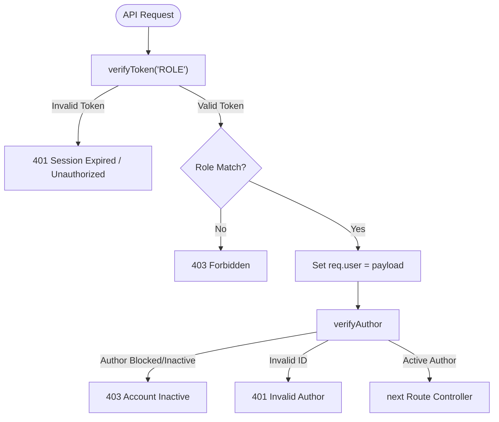

# 🔒 Security, Authentication & Session Strategy

This document details the authentication models, encryption layers, token generations, cookie architectures, and custom security check middleware used by the **BlogApp Backend**.

---

## 🔑 Password Hashing (BcryptJS)

The application prioritizes user credential security by completely decoupling plain-text passwords before storing them in MongoDB:

*   **Algorithm**: **Blowfish block cipher encryption (Bcrypt)**
*   **Complexity**: Enforces **12 rounds of salt generation** (`bcrypt.hash(password, 12)`).
*   **Logic Pipeline**:
    1.  During user creation (`services/authService.js`), a validation check (`await userDoc.validate()`) is run to check parameters.
    2.  The password is encrypted, completely replacing the plain-text property.
    3.  The encrypted document is saved to MongoDB.
    4.  The output document is parsed (`userDoc.toObject()`) and the password field is deleted before returning the payload to the frontend.

---

## 🎟️ JSON Web Tokens (JWT) & Generation

Authentications issue a secure, signed **JSON Web Token** storing essential session properties:

### Token Payload Structure
```json
{
  "userId": "6a0b50e4b3d9d9bd2e2ec661",
  "_id": "6a0b50e4b3d9d9bd2e2ec661",
  "role": "AUTHOR",
  "email": "writer@blogapp.com",
  "firstName": "John",
  "lastName": "Doe",
  "profileImageUrl": "https://res.cloudinary.com/..."
}
```

*   **Signature Key**: The token is signed using `process.env.JWT_SECRET`.
*   **Expiry**: Tokens are bound to a **1-hour expiration timeframe** (`{ expiresIn: "1h" }`) to minimize session hijack windows.

---

## 🍪 HttpOnly Cookie Transport Strategy

To protect tokens from cross-site scripting (XSS) extraction attacks, the backend transfers JWTs exclusively inside **HttpOnly Cookies**:

```javascript
res.cookie("token", token, {
    httpOnly: true,       // Prevents client-side scripts (document.cookie) from reading the token
    sameSite: "none",     // Allows cross-site cookie transfers (frontend hosted on different servers)
    secure: true,         // Enforces transfer ONLY over HTTPS connections
    maxAge: 24 * 60 * 60 * 1000, // Cookie remains valid for 1 day
    partitioned: true     // Enables CHIPS (Cookies Having Independent Partitioned State) for modern browsers
})
```

> [!TIP]
> The addition of `partitioned: true` ensures the session cookie is stored cleanly inside third-party iframe partitions, which prevents modern browser layout engines (like Chrome's Sandbox) from blocking authorization headers in embedded viewports.

---

## 🛡️ Security Middlewares Breakdown

The backend uses two security middleware layers inside the route chains:



### 1. Unified Token Verification Guard (`verifyToken.js`)
*   **Core Logic**: Extracts `req.cookies.token`, parses it via `jwt.verify()`, and attaches the parsed payload directly to `req.user`.
*   **Dynamic Role Check**: Evaluates if the authenticated role exists inside the route parameters:
    ```javascript
    export const verifyToken = (...allowedRoles) => {
        // Enforces role-based route guards
    }
    ```
*   **Exception Catching**: Distinguishes normal validation errors from `TokenExpiredError` (returning a clear session expired message).

### 2. Author DB Status Validator (`verifyAuthor.js`)
*   **Core Logic**: Authors can write, edit, and soft-delete stories. To ensure blocked or deleted accounts are immediately barred from posting, this middleware queries the database directly on each write request:
    1.  Extracts the `authorId` from path parameters or body requests.
    2.  Performs a MongoDB find (`UserTypeModel.findById()`).
    3.  Validates that the account role matches `"AUTHOR"` and that `isActive` equals `true`.
